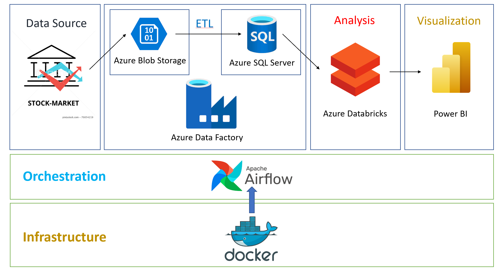
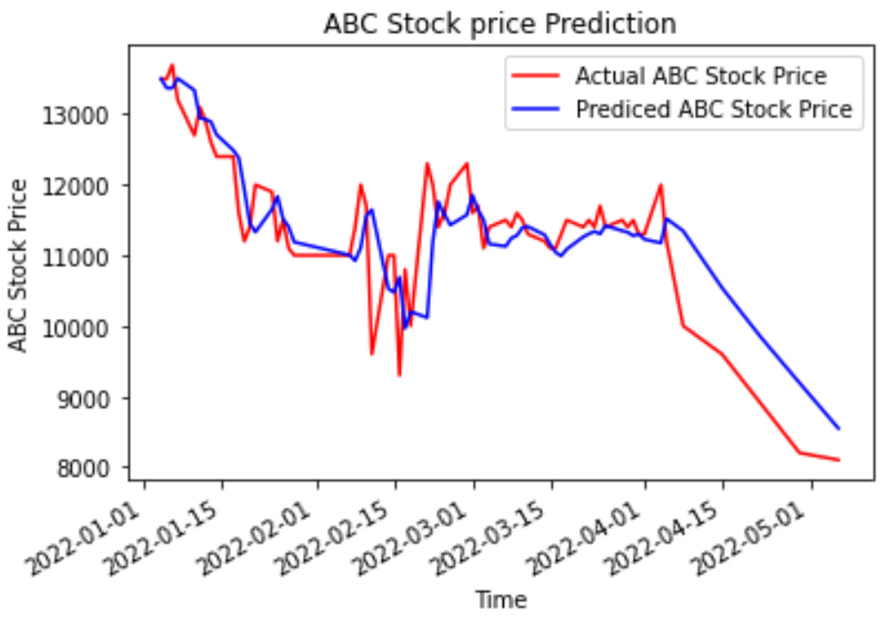
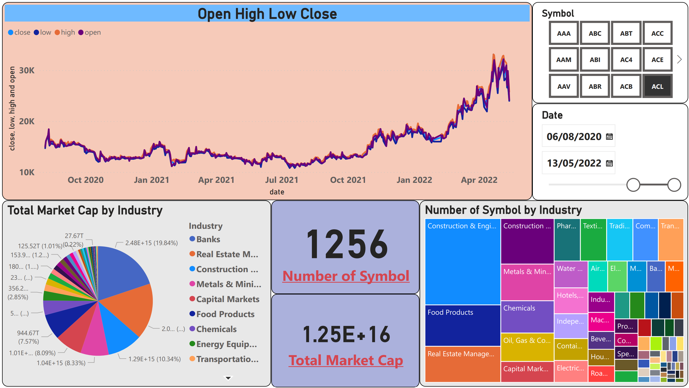
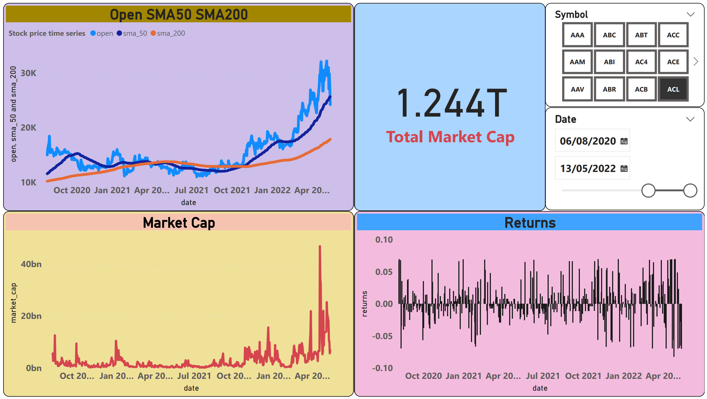
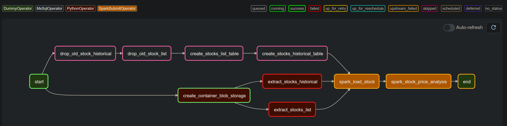
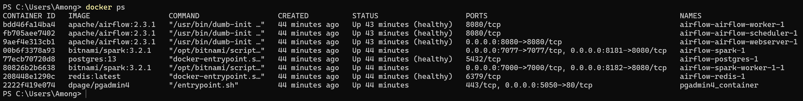
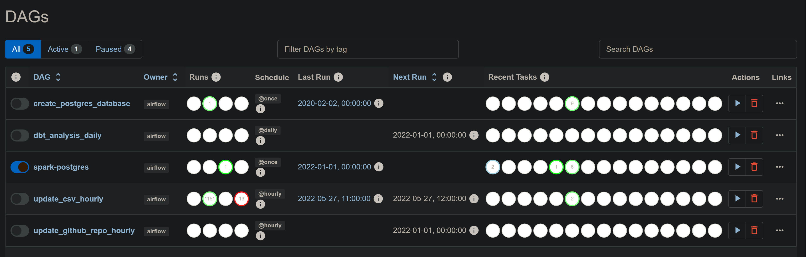
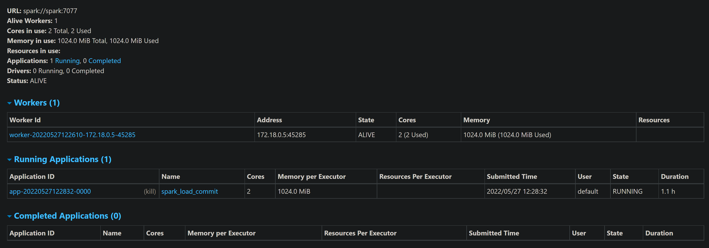
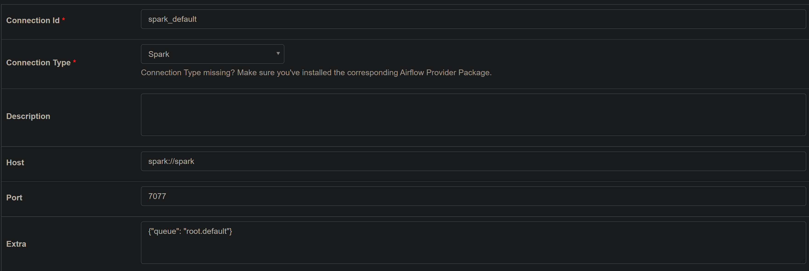

# Stock Price Data Pipeline Using Azure Services

In this project, I will create a data pipeline for collecting Vietnam stock lists and historical stock prices. Use Azure Services tools to ingest data to Azure Storage and Azure Database, do some data analysis, visualize data, and use the LSTM model to predict data.

## Data source
[Investpy](https://github.com/alvarobartt/investpy) is a Python package to retrieve data from Investing.com, which provides data retrieval from up to 39952 stocks, 82221 funds, 11403 ETFs, 2029 currency crosses, 7797 indices, 688 bonds, 66 commodities, 250 certificates, and 4697 cryptocurrencies. In this project, I used Investpy to create ETL data pipeline for Vietnam stock list and stock historical.

[Investing.com](Investing.com) is a financial platform and news website; one of the top three global financial websites in the world. It offers market quotes, information about stocks, futures, options, analysis, commodities, and an economic calendar

## Architecture
|  |
|:--:|
| <b>Design Data Pipeline</b>|

### Tools & Technologies

- Cloud - [**Microsoft Azure**](https://azure.microsoft.com/en-us/)
- Containerization - [**Docker**](https://www.docker.com), [**Docker Compose**](https://docs.docker.com/compose/)
- Batch Processing - [**Spark**](https://spark.apache.org/)
- Data analytics - [**Azure Databricks**](https://docs.microsoft.com/en-us/azure/databricks/)
- Orchestration - [**Airflow**](https://airflow.apache.org)
- Data Lake - [**Azure Blob Storage**](https://docs.microsoft.com/en-us/azure/storage/blobs/)
- Data Warehouse - [**Azure SQL Server**](https://azure.microsoft.com/en-us/products/azure-sql/database/)
- Data Visualization - [**Power BI**](https://powerbi.microsoft.com/en-au/)
- Language - [**Python**](https://www.python.org)


## LSTM model
[LSTM](https://en.wikipedia.org/wiki/Long_short-term_memory) (Long short term memory) is a model that increases the memory of recurrent neural networks. Recurrent neural networks hold short term memory in that they allow earlier determining information to be employed in the current neural networks. For immediate tasks, the earlier data is used. We may not possess a list of all of the earlier information for the neural node. In RNNs, LSTMs are very widely used in Neural networks. Their effectiveness should be implemented to multiple sequence modelling problems in many application domains like video, NLP, geospatial, and time-series.


|  |
|:--:|
| <b>The chart prediction for symbol ABC</b>|

## Final Result
### Power BI visualization
|  |
|:--:|
| <b>All stock dashboard</b>|

|  |
|:--:|
| <b>Stock historical dashboard</b>|

### DAG visualization
|  |
|:--:|
| <b>ETL Stock Price DAG</b>|
# Setup
## Prerequisite
- Install [Docker](https://docs.docker.com/desktop/windows/install/) and [Docker Compose](https://docs.docker.com/compose/install/)

- [Create your own Account and Storage on Azure](https://portal.azure.com/)

- [Create your personal access token on Github](https://docs.github.com/en/authentication/keeping-your-account-and-data-secure/creating-a-personal-access-token). If you don't do this, you can only extract 60 times/hour instead of 5000 times/hour using the GitHub rest api. 

- Remember to use use your own key and version in Docker and Docker Compose file.

## Running
1. Docker - Airflow - Spark

    **a) Service**

    When you check the Docker and Docker Compose file in airflow directory, you can see main services that I used:

    - Postgres - Airflow

        - Version 13
        - Port 5432

    - Airflow Webserver

        - Version Apache Airflow 2.3.1
        - Port 8080

    - Spark Master

        - Version Bitnami Spark 3.2.1
        - Port 8181


    **b) Running**
    ```bash
    cd airflow
    Docker-compose build
    ```
    You will need to wait 10-15 minutes for the first time.

    To run the VM: 
    
    ```bash
    Docker-compose up
    ```
    You also will be asked to wait 10-15 minutes for the first time.
    After running successfully, you can open another terminal and run:
    ```bash
    Docker ps
    ```
    The successful running setup:
    
    |  |
    |:--:|
    | <b>Setup Successfully</b>|

    Now you can check whether it runs or not by using below service urls.

    
    
    | |
    |:--:|
    | <b>Airflow : http://localhost:8080/</b>|

    | |
    |:--:|
    | <b>Spark : http://localhost:8181/</b>|

    
    

    Next you need to add connection on Airflow for 

    | |
    |:--:|
    | <b>[Spark Connection](https://github.com/cordon-thiago/airflow-spark)</b>|

    If you can go there, you have successfully setup Airflow. Now you can run all the tasks.


